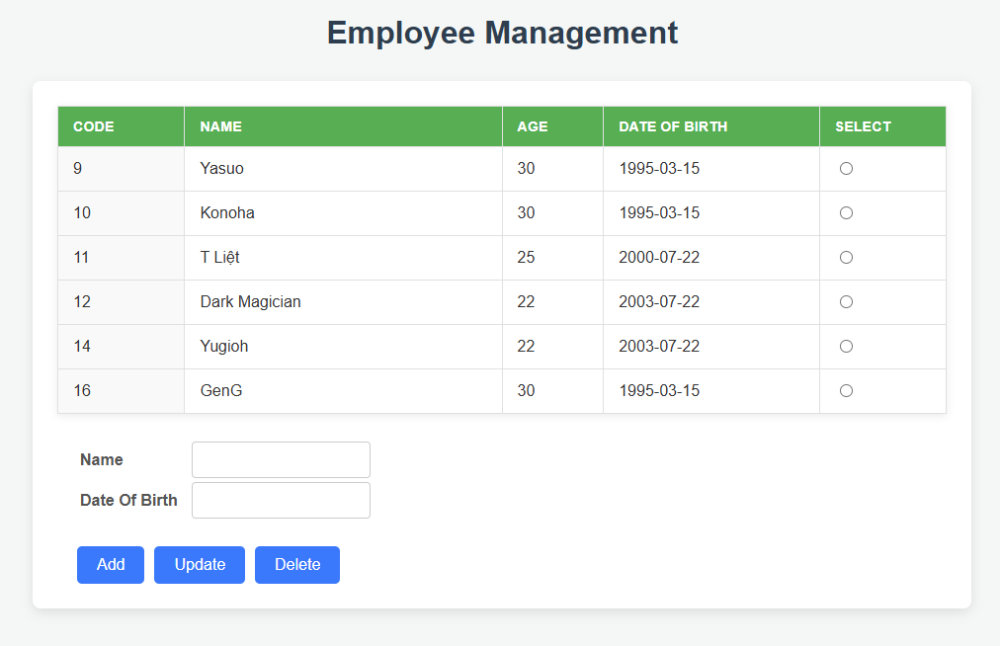
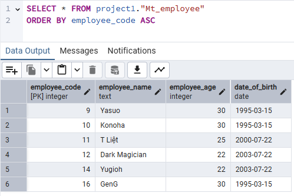

Employee manager with JSF, CDI
>- import project to eclipse
>- install Wildfly 15.0.1Final server in eclipse
>- Setup Postgres database:
>> - Create schema name: project1
>> - Create table Mt_employee(employee_code (PK), employee_name(varchar 255), employee_age(integer), date_of_birth(Date))
>- Run project on WildFly server
>- Go to http://localhost:8080/hello_world_jsf/

